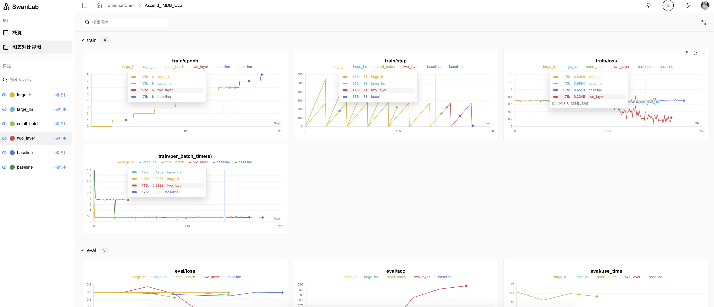
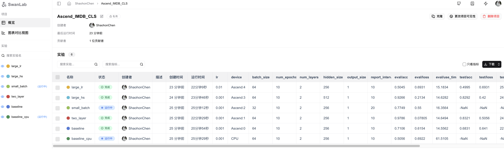

# 华为Ascend NPU训练的IMDB情感分类

## 简介

本项目为使用[mindspore](https://www.mindspore.cn/)实现的IMDB数据集情感分类任务。并使用SwanLab跟踪模型训练进展。

参考[MindSpore官方文档](https://www.mindspore.cn/tutorials/zh-CN/r2.4.1/nlp/sentiment_analysis.html#%E6%95%B0%E6%8D%AE%E9%9B%86%E9%A2%84%E5%A4%84%E7%90%86)，进行整理并简化了部分实现.

## 环境安装

由于华为Ascend环境安装较为复杂，建议参考[MindSpore安装教程和踩坑记录](///)教程完成MindSpore环境安装

也附上官方安装教程链接[mindspore官方安装教程](https://www.mindspore.cn/install)，注意本教程使用的是[Mindspore 2.4.1](https://www.mindspore.cn/versions#2.4.1)，建议环境与本教程保持一致。

此外本教程使用[SwanLab](https://swanlab.cn)进行训练过程跟踪，SwanLab支持对Ascend系列NPU进行硬件识别和跟踪。

其他依赖环境安装方法：

```bash 
pip install -r requirements.txt
```

## 数据集&词编码文件准备

### 数据集准备

Linux使用如下命令完成下载+解压

```bash
wget -P ./data/ https://ai.stanford.edu/~amaas/data/sentiment/aclImdb_v1.tar.gz
tar -xzvf data/aclImdb_v1.tar.gz -C data/
```

### 词编码器准备

使用如下命令下载+解压词编码器文件

```bash
wget -P ./embedding/ https://nlp.stanford.edu/data/glove.6B.zip
unzip embedding/glove.6B.zip -d embedding/
```

## 开始训练

使用如下命令开始训练

```
python train.py
```

可是这

> 如果提示登录swanlab，可以参考[如何登录SwanLab](https://docs.swanlab.cn/guide_cloud/general/quick-start.html#_2-%E7%99%BB%E5%BD%95%E8%B4%A6%E5%8F%B7)，这样将能够使用**云上看版**随时查看训练过程与结果。

完成设置便可以在云上实时看到训练进展，我的实验记录可参考[完整实验记录](https://swanlab.cn/@ShaohonChen/Ascend_IMDB_CLS/charts)



并且附上其他脚本与在线实验记录：

| 内容  | 训练命令  | 实验log  |
|--------|--------|--------|
| 基线 | `python train.py configs/baseline.json` | [log](https://swanlab.cn/@ShaohonChen/Ascend_IMDB_CLS/runs/bbuwb3291pxkoyi00zu16/chart) |
| CPU运行 | `python train.py configs/baseline.json CPU` | [log](https://swanlab.cn/@ShaohonChen/Ascend_IMDB_CLS/runs/htlcflrzpozfcds5o9q93/chart) |
| 双层LSTM | `python train.py configs/two_layer.json` | [log](https://swanlab.cn/@ShaohonChen/Ascend_IMDB_CLS/runs/pywgvlga53wozdb9c2toz/chart) |
| 小batch数 | `python train.py configs/small_batch.json` | [log](https://swanlab.cn/@ShaohonChen/Ascend_IMDB_CLS/runs/pywgvlga53wozdb9c2toz/chart) |
| 隐藏层加大 | `python train.py configs/large_hs.json` | [log](https://swanlab.cn/@ShaohonChen/Ascend_IMDB_CLS/runs/cx0implu0xoxffi57173c/chart) |
| 学习率加大 | `python train.py configs/large_hs.json` | [log](https://swanlab.cn/@ShaohonChen/Ascend_IMDB_CLS/runs/tsyxib42islmlsay1ogna/chart) |

相关超参数和最终结果可在[图标视图查看](https://swanlab.cn/@ShaohonChen/Ascend_IMDB_CLS/overview)



> PS: 观察了下日志，发现还是训练量不足，应该增大些训练量（40-50epoch比较合适）